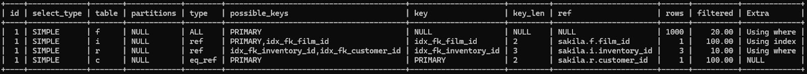
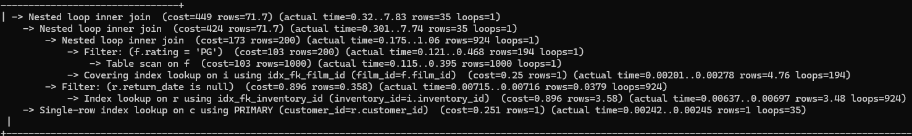

### Explain

Komenda "EXPLAIN" jest kluczowym narzędziem w MYSQL do optymalizacji zapytań. Dostarcza nam szczegółowej analizy tego w jaki
sposób zapytanie jest wykonywane krok po kroku.

Pozwala nam znaleźć miejsca, gdzie nieefektywnie wykonujemy za dużo operacji, jak pełne skany tabeli.

### Przykładowy użycie polecenia "EXPLAIN"

Sakila to przykładowa baza danych mysql, udostępniona przez Oracle do nauki, testów i demonstracji możliwości SQL oraz MYSQL.

```sql
EXPLAIN SELECT f.title, r.rental_date, c.first_name, c.last_name
FROM sakila.film f
JOIN sakila.inventory i ON f.film_id = i.film_id
JOIN sakila.rental r ON i.inventory_id = r.inventory_id
JOIN sakila.customer c ON r.customer_id = c.customer_id
WHERE f.rating = 'PG' AND r.return_date IS NULL;
```

A oto wynik:



Rezultat komendy "EXPLAIN" to table ze szczegółami planu wykonania zapytania:

1. id: identyfikuje polecenie "SELECT" do którego wiersz się odnosi. W przykładzie powyżej wszystkie cztery wiersze
mają id równe 1, co oznacza, że zapytanie ma w sobie tylko jedno polecenie "SELECT".
2. select_type: identyfikuje typ polecenia "SELECT" do którego ten wiersz się odnosi. W przykładzie powyżej wszystkie
cztery wiersze mają wartość "SIMPLE" co oznacza, że jest to proste polecenie "SELECT" bez podzapytań ani poleceń "UNION".
3. table: odnosi się do tabeli w bazie danych, której dotyczy wiersz. Używa aliasu użytego w zapytaniu, w przykładzie powyżej
mamy cztery wartości "f", "i", "r", "c", są to aliasy tabel "film", "inventory", "rental", "customer".
4. type: odnosi się do typu użytego "joina". Możliwe wartości to: ALL (full table scan), index (index scan), 
range (range scan on indexed column), ref (non-unique index lookup), eq_ref (unique index lookup), const (single row lookup)
i NULL (no access required). W powyższym przykładzie mamy używane typy join "ALL", "ref" i "eq_ref".
5. possible_keys: ta kolumna zawiera indeksy, których MySQL może (nie musi) użyć do znalezienia wierszy w tabeli. Pomaga
zrozumieć, które indeksy MySQL rozważy.
6. key: ta kolumna wskazuje na faktyczny indeks użyty do wykonania zapytania, w powyższym przykładzie dla tabeli "r" (rental),
mamy wymienione trzy możliwe indeksy do użycia, ale użyty zostaje indeks "idx_fk_inventory_id".
7. key_len: ta kolumna wskazuje na długość użytego klucza. To liczba bajtów danych, które MySQL używa z indeksu. Patrząc
na przykład powyżej, "i" (inventory) używa dwóch bajtów.
8. ref: ta kolumna wskazuje na kolumny bądź stałe wartości używane do pobierania wierszy z tabeli. Patrząc na "i" (inventory)
jest to kolumna "sakila.f.film_id".
9. rows: ta kolumna mówi nam przybliżoną ilość wierszy, jakich mysql użyje do wykonania zapytania. Więc dostarcza
przybliżonej ilości wierszy, które pasują do warunków. Na przykład dla tabeli "f" (film) jest to 1000 wierszy.
10. filtered: 
11. extra: ta kolumna jest używana do wyświetlenia dodatkowych informacji na temat wykonania zapytania. Np.: czy tabela tymczasowa
jest użyta bądź czy użyte jest "file sort". Często zawiera "Using where" co wskazuje, że używamy klauzuli WHERE do filtrowania wierszy.
Dalej "Using index" co wskazuje na użycie indeksu.

### Czym jest komenda EXPLAIN ANALYZE?

Komenda "EXPLAIN ANALYZE" została wprowadzona pod koniec 2019 roku jako ulepszenie komendy "EXPLAIN". Różnica jest taka,
że "EXPLAIN ANALYZE" rzeczywiście wykonuje zapytanie do bazy danych i przedstawia użyty plan wykonania zapytania, czyli
przedstawia fakty zamiast teorii. 

Według tego, co próbowałem zrobić działanie tej komendy w MySQL i MariaDB prawdopodobnie się różni. Np.: w MariaDB składnia
zapytania wygląda następująco: 

```sql
ANALYZE SELECT f.title, r.rental_date, c.first_name, c.last_name
FROM sakila.film f
JOIN sakila.inventory i ON f.film_id = i.film_id
JOIN sakila.rental r ON i.inventory_id = r.inventory_id
JOIN sakila.customer c ON r.customer_id = c.customer_id
WHERE f.rating = 'PG' AND r.return_date IS NULL;
```

W MariaDB używamy "ANALYZE" zamiast "EXPLAIN ANALYZE". Tabela wynikowa jest podobna, lecz zawiera trzy dodatkowe kolumny,
których nie ma przy zwykłym "EXPLAIN". Są to:

- r_rows
- filtered
- r_filtered

Z kolei format odpowiedzi w MySQL mocno się różni, tak wygląda:



**Należy zwrócić uwagę, że w MySQL EXPLAIN ANALYZE wykonuje też zapytania jak UPDATE czy DELETE. Należy uważać, żeby
przez przypadek nie zmienić danych.**