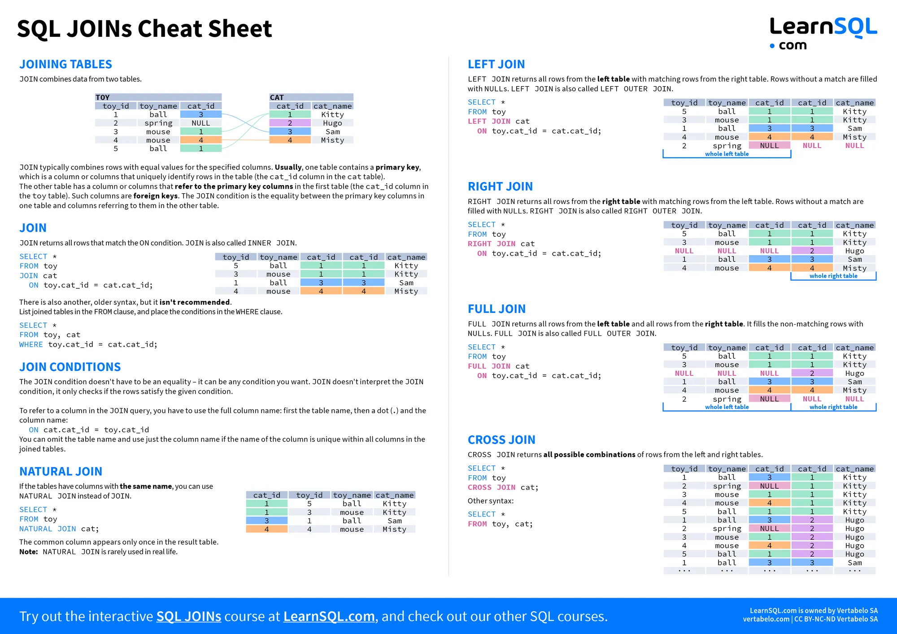
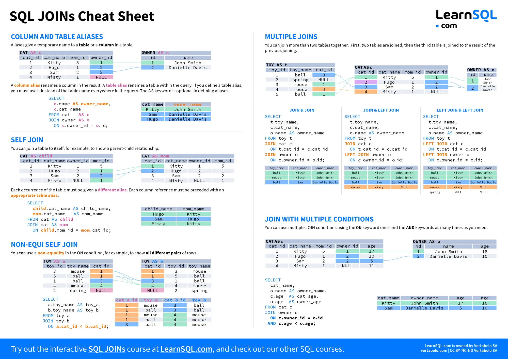
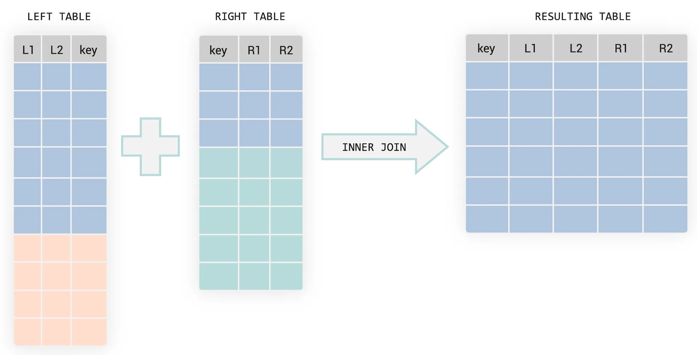
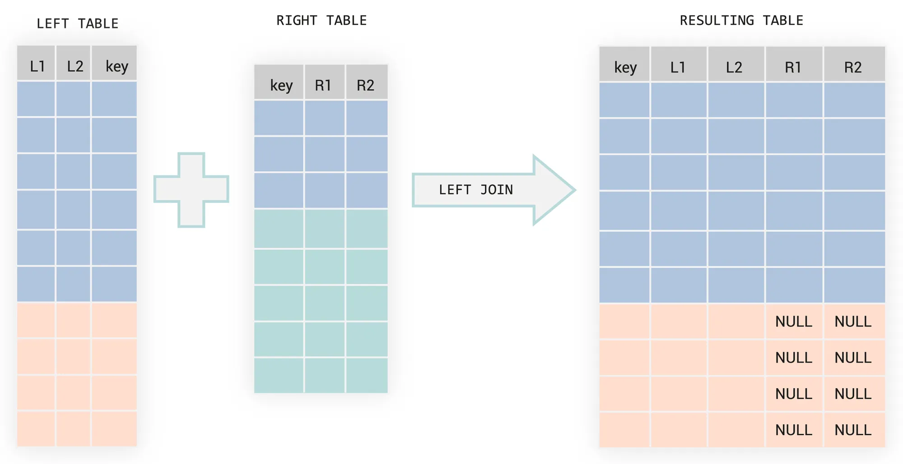
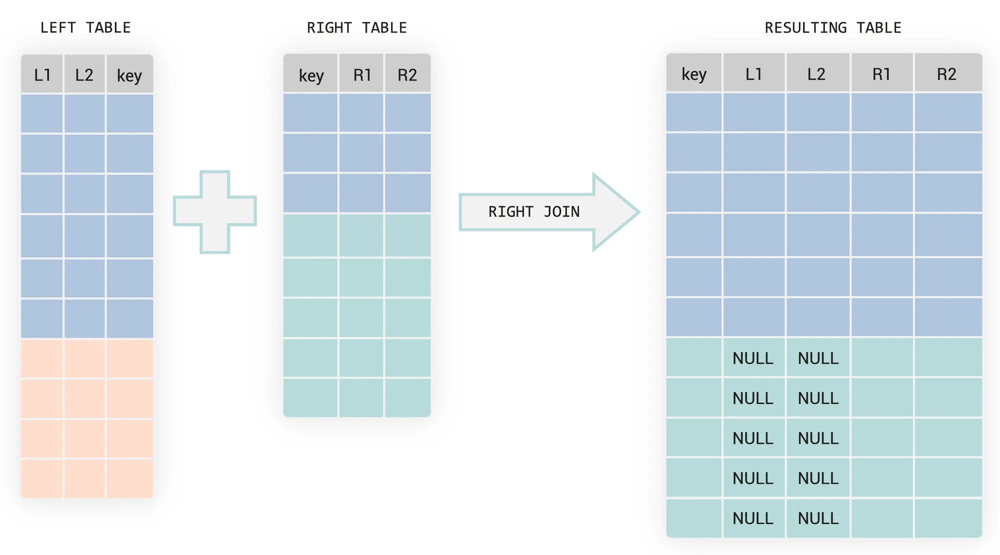
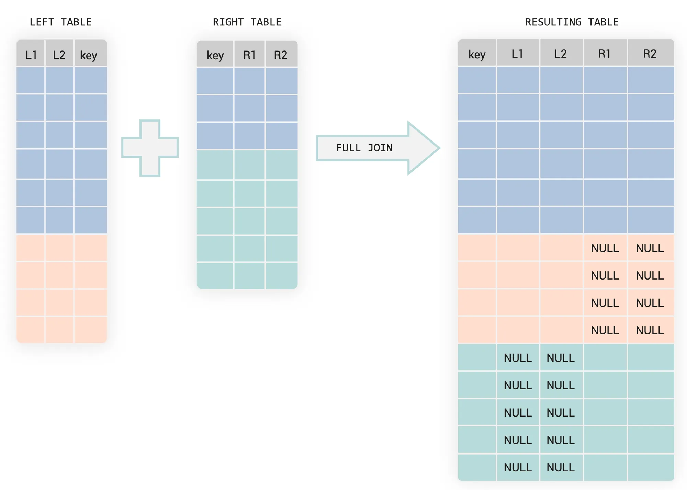

### Czym jest SQL JOIN?

Klauzula JOIN jest używana, gdy chcemy połączyć ze sobą dane z dwóch lub więcej tabel.
Rekordy z dwóch tabel są łączone na podstawie warunku (nazywanego również: JOIN predicate), który podaje się przy
klauzuli JOIN. Jeśli ten warunek zostanie spełniony rekord będzie uwzględniony w tablicy wynikowej.

Typy JOINÓW w SQL to:
- INNER JOIN (znany również jako prosty "JOIN")
- LEFT JOIN (lub pełna nazwa: LEFT OUTER JOIN)
- RIGHT JOIN (lub pełna nazwa: RIGHT OUTER JOIN)
- FULL JOIN (lub pełna nazwa: FULL OUTER JOIN)
- SELF JOIN
- CROSS JOIN





### INNER JOIN

INNER JOIN jest używany do wyświetlania pasujących do siebie rekordów z dwóch tabel, to znaczy takich, które spełniają 
warunek klauzuli WHERE. Jest też nazywanym zwykłym JOIN-EM, w praktyce można użyć tylko słowa kluczowego JOIN zamiast 
pełnego INNER JOIN.

Z reguły podczas łączenia tabel jest ich dwie, choć może być ich więcej. Rozróżniamy wtedy lewą tabelę i prawe tabele.
Lewa tabela jest w klauzuli "FROM", czyli po lewej stronie słowa kluczowego "JOIN". Prawa tabela jest pomiędzy słowami
kluczowymi "JOIN" i "ON".

```sql
SELECT s.id, s.name, c.name FROM series s INNER JOIN series_category c ON s.category_id = c.id;
```

W powyższym przykładzie tabela "series" jest tabelą po lewej stronie a tabela "series_category" jest tabelą po prawej 
stronie.



### LEFT JOIN

Czasami istnieje potrzeba wyświetlenia wszystkich rekordów z tabeli po lewej stronie, nawet jeśli nie mają 
odpowiadającego sobie rekordu po prawej stronie. Używając LEFT JOIN wyświetlą się wszystkie rekordy z tabeli 
po lewej stronie a kolumny, które powinny być pobrane z tabeli po prawej stronie przyjmą wartość "NULL". To daje dużo 
możliwości przy pisaniu zapytań sql, na przykład, jeśli chcemy pobrać tylko tych klientów, którzy nie mają zamówień 
w naszym sklepie, moglibyśmy po lewej stronie użyć tabeli z klientami, a po prawej tabeli wynikowej z pogrupowanym 
zamówieniami przy użyciu kolumny "customer_id". Połączymy tabele używając id klienta, następnie dodamy klauzulę "WHERE",
która wyświetli tylko rekordy, które mają wartość "NULL" po prawej stronie.

```sql
SELECT
    c.customer_id,
    c.name,
    o.total_orders
FROM customers c
LEFT JOIN (
    SELECT
        customer_id,
        COUNT(*) AS total_orders
    FROM orders
    GROUP BY customer_id
) o
   ON c.customer_id = o.customer_id
WHERE o.total_orders IS NULL;
```



### RIGHT JOIN

Podobnie do "LEFT JOIN", "RIGHT JOIN" wyświetla wszystkie rekordy z prawej tabeli, nawet jeśli żaden rekord nie pasuje z
lewej strony.



### FULL (OUTER) JOIN

FULL JOIN to połączenie LEFT I RIGHT JOIN w jednym, to znaczy FULL JOIN sprawia, że w tabeli wynikowej będziemy mieli
rekordy, które spełniają warunek w klauzuli ON i mają dane w obydwu tabelach, następnie wszystkie rekordy z lewej strony,
które nie mają odpowiednika po prawej stronie. A na końcu jeszcze wszystkie rekordy z prawej strony, które nie mają 
odpowiednika po lewej stronie.



### CROSS JOIN

CROSS JOIN tworzy wszystkie możliwe kombinacje wierszy z dwóch tabel. Więc jeśli obydwie tabele mają po 10 rekordów. 
Łączna liczba rekordów w tabeli wynikowej wyniesie 10 * 10 = 100.

W CROSS JOIN nie podaje się warunku łączenia. Jego zadaniem jest zwrócenie iloczynu kartezjańskiego dwóch tabel.
Iloczyn kartezjański to matematyczne pojęcie, które opisuje wszystkie możliwe pary elementów utworzone z dwóch zbiorów.

```sql
SELECT *
FROM employees
CROSS JOIN weekdays;
```

Jednak możliwe jest używanie klauzuli "WHERE" w zapytaniu z CROSS JOIN. 

```sql
SELECT *
FROM table1
CROSS JOIN table2
WHERE table1.id = table2.car_id;
```

Jednak wtedy nie jest to już iloczyn kartezjański a równoważnik INNER JOIN napisany przy pomocy innej składni.

### SELF JOIN

W sql możemy również zrobić JOIN tej samej tabeli. Nie ma dedykowanej składni dla "SELF JOIN", zamiast tego używa się 
INNER JOIN bądź jakiegokolwiek innego rodzaju JOIN-a, wtedy po prostu po lewej i prawej stronie JOIN podajemy tą samą tabelę.

```sql
SELECT
  e.id,
  e.first_name,
  e.last_name,
  e.salary,
  m.first_name AS fname_boss,
  m.last_name AS lname_boss
FROM employee e
JOIN employee m
  ON e.manager_id = m.id;
```

Kiedy powinno używać się SELF JOIN?
- W tabelach hierarchicznych np.: w strukturach magazynowych z reguły używamy drzew, gdzie każdy liść poza korzeniem ma 
swojego rodzica. Możemy wtedy w jednym rekordzie mieć dane liścia i jego rodzica. Tak jak w przykładzie powyżej w jednym
rekordzie mamy dane pracownika i jego menedżera.
- W tabelach sekwencyjnych
- Przy danych grafu

